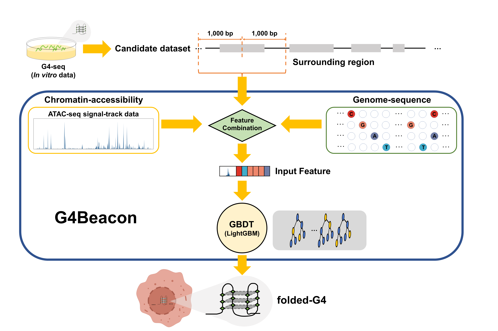

# G4Catcher: An in vivo G4 prediction method using chromatin and sequence information

## I. Introduction

G-quadruplex (G4) is a kind of the non-canonical secondary structure which usually formed in guanine-rich regions. G4 detection method based on next-generation sequencing technology allows profiling G4s in vitro on a genome-wide scale, which imputed numerous G4 entries on the human genome. However, recent G4 ChIP-seq technology established for in vivo G4 detection revealed that the amount of G4s in living cells is substantially lower. In vivo G4 sites can provide more convincing support for exploring the biological function of G4s, as these sites are direct evidence for the presence of folded G4s. However, there are some limitations to the G4-probing methods, for example, they are high-cost and difficult to operate. We proposed G4Catcher, a new machine-learning approach to predict whether in vitro G4 entries can actually fold into quadruplex structures in a given cell type, by integrating the chromatin accessibility profile and the surrounding sequence of G4 entries.

## II. Code Structure

-  `/SCRIPT`
  - `dataPreprocess`: the python-scripts for data preprocessing.
  - `prediction`: the codes of the whole classifier-implement and scripts of model evaluation.
  - `visualization`: the util-codes for result-visualization.

## Old-version Log

\- version 0.1: Use narrowPeak from ATAC-seq as chromatin accessibility features

\- version 0.2: Try K-mer features; Add SMOTE-oversampling experiment

\- version 0.3:  Use JSON as the experiment config input and log; Use signal/fold-change files as chromatin accessibility features. [Last updated: 2021/11/15]

