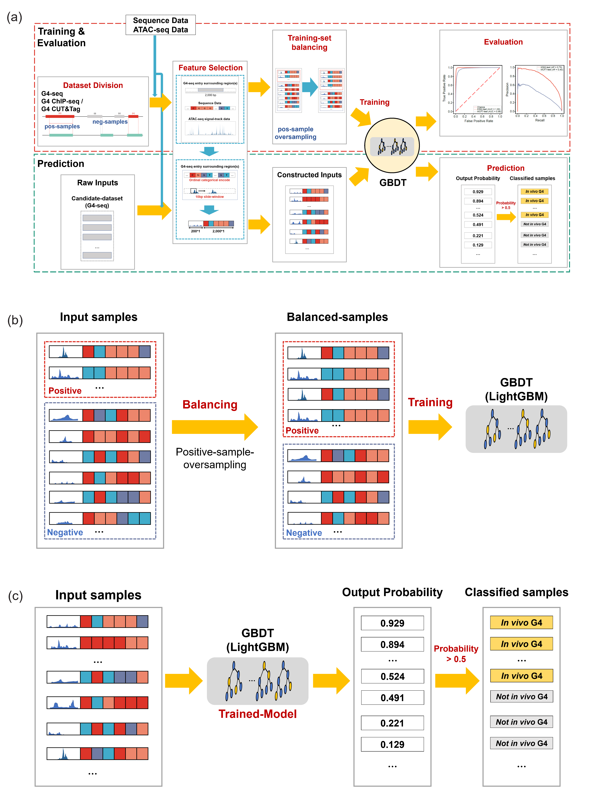

# G4Beacon: An *in vivo* G4 prediction method using chromatin and sequence information

##  Introduction

G-quadruplex (G4) is a kind of the non-canonical secondary structure which usually formed in guanine-rich regions. G4 detection method based on next-generation sequencing technology allows profiling G4s in vitro on a genome-wide scale, which imputed numerous G4 entries on the human genome. However, recent G4 ChIP-seq technology established for in vivo G4 detection revealed that the amount of G4s in living cells is substantially lower. In vivo G4 sites can provide more convincing support for exploring the biological function of G4s, as these sites are direct evidence for the presence of folded G4s. However, there are some limitations to the G4-probing methods, for example, they are high-cost and difficult to operate. We proposed G4Beacon, a new machine-learning approach to predict whether in vitro G4 entries can actually fold into quadruplex structures in a given cell type, by integrating the chromatin accessibility profile and the surrounding sequence of G4 entries.


##  Prerequisites

### Dependencies

- Ubuntu 20.04.4 LTS
- Bedtools 2.29.2
- Deeptools 3.5.1
- Python 3.9.7
  - LightGBM 3.2.1
  - imblearn 0.8.1
  - scikit-learn 1.0.1

### Installation

The Linux command tools: *bedtools* and *deeptools* should be installed and added to `PATH` before you used *G4Beacon*.
We provide a `requirements.txt` for you to install the dependencies. It's more recommanded to use *G4Beacon* by creating a new env with *anaconda*.

```bash
pip install -r requirements.txt
```

##  Code Structure

- `/G4Beacon`
  - `userInterface` : the wieldy python-scripts provided for users;
  - `pretrainedModels` : the pre-trained models provided for users, which can be used directly in the *prediction* step;
  - `dataPreprocess` : the python-scripts for data preprocessing;
  - `prediction` : the codes of the whole classifier-implement and scripts of model evaluation;
  - `visualization` : the util-codes for result-visualization.

##  Workflow & Usage



### Training

#### 1. Training-set Preparing

```bash
cd userInterface

# Pos/neg data division
# For combination of {posChain-G4ChIPpos, negChain-G4ChIPpos, posChain-G4ChIPneg, negChain-G4ChIPneg}
bedtools intersect -a ${G4SEQ_PATH}/GSM3003539_Homo_all_w15_th-1_plus.hits.max.K.w50.25.bed \
                    -b ${G4CHIP_PATH} \
                    -wa -F 0.1 | sort -k1,1 -k2,2n -u > plus.g4seqFirst.F0.1.bed &&

bedtools intersect -a ${G4SEQ_PATH}/GSM3003539_Homo_all_w15_th-1_plus.hits.max.K.w50.25.bed \
                    -b ${G4CHIP_PATH} \
                    -v -F 0.1 | sort -k1,1 -k2,2n -u > plus_v.g4seqFirst.F0.1.bed &&

bedtools intersect -a ${G4SEQ_PATH}/GSM3003539_Homo_all_w15_th-1_minus.hits.max.K.w50.25.bed \
                    -b ${G4CHIP_PATH} \
                    -wa -F 0.1 | sort -k1,1 -k2,2n -u > minus.g4seqFirst.F0.1.bed &&

bedtools intersect -a ${G4SEQ_PATH}/GSM3003539_Homo_all_w15_th-1_minus.hits.max.K.w50.25.bed \
                    -b ${G4CHIP_PATH} \
                    -v -F 0.1 | sort -k1,1 -k2,2n -u > minus_v.g4seqFirst.F0.1.bed &&

python g4seqPreprocess.py \
    -i plus.g4seqFirst.F0.1.bed \
    -oseq plus.g4seqFirst.F0.1.ex1000.seq.csv \
    -obi plus.g4seqFirst.F0.1.ex1000.origin.bed \
    -fi ${REF_PATH} \
    --extend 1000 --reverse &&

python g4seqPreprocess.py \
    -i plus_v.g4seqFirst.F0.1.bed \
    -oseq plus_v.g4seqFirst.F0.1.ex1000.seq.csv \
    -obi plus_v.g4seqFirst.F0.1.ex1000.origin.bed \
    -fi ${REF_PATH} \
    --extend 1000 --reverse &&

python g4seqPreprocess.py \
    -i minus.g4seqFirst.F0.1.bed \
    -oseq minus.g4seqFirst.F0.1.ex1000.seq.csv \
    -obi minus.g4seqFirst.F0.1.ex1000.origin.bed \
    -fi ${REF_PATH} \
    --extend 1000 &&

python g4seqPreprocess.py \
    -i minus_v.g4seqFirst.F0.1.bed \
    -oseq minus_v.g4seqFirst.F0.1.ex1000.seq.csv \
    -obi minus_v.g4seqFirst.F0.1.ex1000.origin.bed \
    -fi ${REF_PATH} \
    --extend 1000

# Construct the chromatin-accessibility feature
# For feature in {vg4-pos, vg4-neg, ug4-pos, ug4-neg}:
python computeMatrix.py \
       -p          [threadNums] \
       --g4Input   [g4seq-origin-bed file imported from the former step] \
       --envInput  [ATAC-seq signal-track file (BIGWIG)] \
       --csvOutput [Output path of the result atac feature file (CSV)]

# Cat pos/neg chain data
cat [vg4-pos seq CSV] [vg4-neg seq CSV] > [vg4 seq CSV]
cat [ug4-pos seq CSV] [ug4-neg seq CSV] > [ug4 seq CSV]
cat [vg4-pos atac CSV] [vg4-neg atac CSV] > [vg4 atac CSV]
cat [ug4-pos atac CSV] [ug4-neg atac CSV] > [ug4 atac CSV]


# Construct training set (over-sampling)
python constructTrainingSet.py \
       --vg4seqCSV  [Positive seq-feature file path (CSV)] \
       --ug4seqCSV  [Negative seq feature file path (CSV)] \
       --vg4atacCSV [Positive atac feature file path (CSV)] \
       --ug4atacCSV [Negative atac feature file path (CSV)] \
       --outdir     [result output dir]
```

#### 2. Model Training

```bash
cd userInterface

python Training.py \
       --vg4seqCSV  [Positive seq-feature file path (CSV)] \
       --ug4seqCSV  [Negative seq feature file path (CSV)] \
       --vg4atacCSV [Positive atac feature file path (CSV)] \
       --ug4atacCSV [Negative atac feature file path (CSV)] \
       --oname      [prefix-name of the output trained-model-param file (JOBLIB)] \
       --outdir     [output file dir]
```

### Prediction

#### 1. Feature Construction

```bash
cd userInterface

# Build G4-candidate dataset and construct the sequence feature
# For g4seq file of {pos, neg} chains:
python g4seqPreProcess.py \
     -i    [G4-seq data path (BED)] \  # sorted GSE110582-K+ (like: GSM3003539_Homo_all_w15_th-1_plus.hits.max.K.w50.25.bed)
     -fi   [Reference-genome data path (FASTA)] \ # the pre-trained model we provided is under hg19
     -oseq [Output path of the result seq feature file (CSV)] \
     -obi  [Output path of the result cleaned g4-seq entries (the "origin-bed file") (BED)] \
     --extend 1000 \
     {--reverse} # It's essential for neg-chain data

# Construct the chromatin-accessibility feature
# For feature in {pos, neg}:
python computeMatrix.py \
       -p          [threadNums] \
       --g4Input   [g4seq-origin-bed file imported from the former step] \
       --envInput  [ATAC-seq signal-track file (BIGWIG)] \
       --csvOutput [Output path of the result atac feature file (CSV)]
```

#### 2. Prediction

```bash
cd userInterface

# For feature in {pos, neg}:
python getActiveG4s.py \
       --seqCSV     [seq-feature file (CSV) generated in 'g4seqPreProcess' step] \
       --atacCSV    [atac-feature file (CSV) generated in 'ComputeMatrix' step] \
       --originBED  [origin-g4-seq-entry file (BED) generated in 'g4seqPreProcess' step] \
       --model      [trained param file (JOBLIB) of G4Beacon] \
       -o           [in vivo G4 entries (BED)]
```
